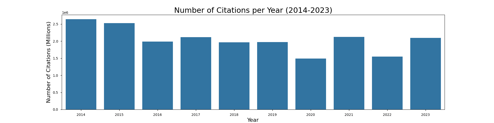

# City of LA: Savings Strategy for Parking Enforcement

### Background

With its slow growth in parking infrastructure, restrictive parking requirement policies, and high dependence on automobiles as the preferred method of travel, one might think the City of Los Angeles generates a healthy amount of its annual profits from its Parking Enforcement Department. Being a LA citizen for the past 6 years, I will admit that I, myself, have paid my fair share of those infamous $73 parking citations. So you may understand my disbelief when I read [this post](https://xtown.la/2021/10/18/parking-tickets-budget/) from a local news outlet stating that the City of LA was actually *losing* **$10 - $50 million dollars each year from 2017 - 2022** on salary and equipment expenses. 

Some public officials have gone on the record to state that the city does not intend to generate revenue from the Parking Enforcement Program but rather ensure "compliance with parking restrictions" (i.e. maintaining clear roads for first responders and street sweeping vehicles), yet [annual budget reports](https://openbudget.lacity.org/#!/year/2024-2025/revenue/0/fund_type/General+Fund/0/revenue_source) published by the City of LA still include "Parking Fines" as a revenue category. Either way, the City of LA benefits from shrinking the annual losses of the Parking Enforcement Department. This can happen one of two ways: revenue (citation fees or volume) increases or departmental efficiency increases. 

Since citation payment delinquincy rates have been shown to rise as a result of increased parking citation fees, a simpler strategy would be to target the department's expenses, namely salaries. Currently, the salaries of over 1200 full-time Parking Enforcement Officers (PEOs) are budgeted into the city's annual expense report for 2024. With roughly 1.8 million citations written per year in total, *each PEO is writing on average 1 parking ticket every 2 - 2.5 hours*.

### Aim

In this project, I will investigate whether timeseries forecasting on historical parking citation data can be leveraged to improve the accuracy of city budgeting and to offer insights to better optimize the deployment of PEOs for increased departmental efficiency.

### Contents

